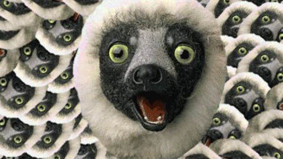

```{r load-packages, include = FALSE}
# Add any additional packages you need to this chunk
library(tidyverse)
library(tidymodels)
library(palmerpenguins)
library(knitr)
library(xaringanthemer)
library(dplyr)
```

```{r setup, include=FALSE}
# For better figure resolution
knitr::opts_chunk$set(fig.retina = 3, dpi = 300, fig.width = 6, fig.asp = 0.618, out.width = "80%")
```

```{r load-data, include=FALSE}

lemurs <- readr::read_csv('https://raw.githubusercontent.com/rfordatascience/tidytuesday/master/data/2021/2021-08-24/lemur_data.csv')

#write_csv(lemurs, file = "../data/lemurs.csv")

# glimpse(lemurs)

lemurs_subset <- lemurs %>% 
  filter(taxon == c("MMUR", "PCOQ", "NCOU", "CMED", "LCAT")) %>% 
  filter(birth_type == c("CB", "WB"))
```

```{r, include=F}
style_xaringan(
  title_slide_background_image = "img/confetti.jpg"
)
```

class: center, middle

## Meet the Lemurs

---
.pull-left[
```{r PCOQ, echo = FALSE, out.width = "45%", fig.align = "center", fig.cap = "Coquerel’s Sifaka - PCOQ"}

```
]

.pull-right[
```{r MMUR, echo = FALSE, out.width = "75%", fig.align = "center", fig.cap = "Gray Mouse Lemur - MMUR"}

```
]


```{r NCOU, echo = FALSE, out.width = "40%", fig.align = "center", fig.cap = "Slow Loris - NCOU"}

```

---
.pull-left[
```{r CMED, echo = FALSE, out.width = "100%", fig.align = "center", fig.cap = "Fat-Tailed Dwarf Lemur - CMED"}

```
]

.pull-right[
```{r LCAT, echo = FALSE, out.width = "100%", fig.align = "center", fig.cap = "Ring Tailed Lemur - LCAT"}

```
]
---

class: inverse, center, middle

# Data Wrangling 

---

# Methods

---

# Methods


```{r taxon-count, echo=FALSE}
lemurs %>% 
  ggplot(data = lemurs, mapping = aes(taxon, color = taxon)) +
    geom_bar()
```


---

# Code
.pull-left[
```{r lemur-age-living, out.width = "200%", echo=FALSE, message=FALSE, warning=FALSE}
lemurs_subset %>% 
  ggplot(aes(x = age_of_living_y, color = sex)) + 
  geom_histogram() + 
  facet_wrap(~taxon)
```
]
.pull-right[
```{r litter-size, out.width= "200%", echo=FALSE, message=FALSE, warning=FALSE}
lemurs_subset %>% 
  ggplot(aes(x = litter_size, y= weight_g, color = taxon)) + 
  geom_point() + 
  facet_wrap(~taxon)
```
]

---

# Results and Conclusions 

.pull-left[

- Lemur populations have been largely grown in captivity due to deforestation and displacement

]

---

# Conclusion

---

# Conclusion

.pull-left[

- We concentrated our data by focusing on 5 species of lemurs

- (I really need to see the other slides before making a quick conclusion)

- We did this

- We did that

- We did this some more

]

.pull-right[
```{r lemur-fractal, echo = FALSE, out.width = "100%", fig.align = "center"}

```
]

- Lemur lifespans heavily depends on weight, sex does not play a major determining factor in lifespan

--

- A higher litter size usually means a high lifespan as well. Also depends on weight because smaller lemur species who have a higher litter size will still have a relatively small lifespan. 

